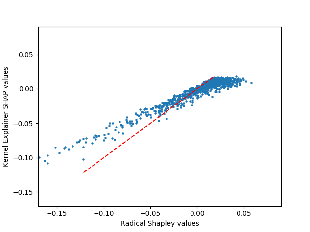

# exact-shapley-values
Python code to directly compute Shapley values for model features (expected value of the contribution of a feature across all possible feature coalitions)

The demo script demonstrates how to use the function and how in some conditions it can be faster than the SHAP library. 

## Demonstrated case

With a randomly generated dataset with a low number of features (M = 4, N = 10^5), shap values are computed using the exact_shapley_values function and the SHAP library. 

### Using the kernel explainer - exact values are computed much faster when num_features is low
When the model is an Isolated Forest, which is supported only with SHAP's kernel_explainer, the run time is:   
exact_shapley_values: 133 seconds for 10^5 samples   
kernel_explainer:     0.12 sec per sample, for expected total of ~12000 sec for 10^5 samples   

The difference (and correlation) between the exact and estimated Shapley values can be seen in this scatter plot: 

On the other hand, the advantage for the exact computation diminishes rapidly since its run time increases exponentially with the number of features. 

### Using the tree explainer - efficient implementation 
When the model is XGBoost, which has an efficient implementation in SHAP's tree_explainer, the run time is:   
exact_shapley_values: 97 sec for 10^5 samples  
tree_explainer:       22 sec for 10^5 samples  

